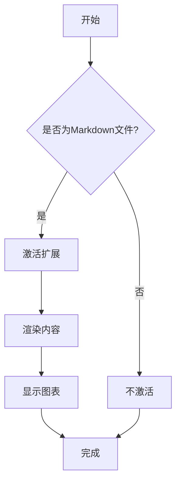
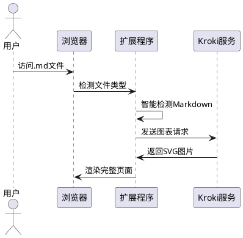

# 🔧 修复验证测试文档

## 📋 **修复问题列表**

### ✅ 问题1：网络请求被阻塞 (net::ERR_NAME_NOT_RESOLVED)
- **修复内容**：更新manifest.json的CSP策略和host_permissions
- **预期结果**：外部图片和API请求能正常加载

### ✅ 问题2：Content Script激活检测
- **修复内容**：智能Markdown文件检测，支持多种平台和内容特征
- **预期结果**：能正确识别更多类型的Markdown文件

### ✅ 问题3：图表渲染失败
- **修复内容**：改进Kroki渲染器错误处理和网络请求
- **预期结果**：图表能正常渲染，提供详细错误信息

---

## 🧪 **测试用例**

### 1. 📊 **流程图测试**

#### Mermaid流程图


### 2. 🏗️ **PlantUML图表**


### 3. 🖼️ **图片渲染测试**

#### 外部图片（之前会出现ERR_NAME_NOT_RESOLVED）


#### 本地图标测试
- 📝 文档图标
- 🔧 设置图标  
- 📊 图表图标
- ✅ 成功图标

### 4. 📝 **Markdown基础元素测试**

#### 标题层级
# 一级标题
## 二级标题
### 三级标题

#### 文本样式
- **粗体文本**
- *斜体文本*
- `行内代码`
- ~~删除线~~

#### 列表测试
1. 有序列表项1
2. 有序列表项2
   - 无序子项
   - 另一个子项

#### 表格测试
| 功能 | 修复前 | 修复后 |
|------|-------|-------|
| 图表渲染 | ❌ 失败 | ✅ 成功 |
| 网络请求 | ❌ 被阻塞 | ✅ 正常 |
| 文件检测 | ❌ 严格 | ✅ 智能 |

#### 代码块测试
```javascript
// JavaScript代码测试
function testExtension() {
  console.log('扩展程序修复测试');
  return {
    charts: '✅ 图表渲染正常',
    images: '✅ 图片加载正常',
    detection: '✅ 文件检测智能'
  };
}
```

```python
# Python代码测试
def test_markdown_features():
    """测试Markdown功能"""
    features = {
        'mermaid': True,
        'plantuml': True,
        'external_images': True,
        'smart_detection': True
    }
    return all(features.values())
```

### 5. 🔗 **链接测试**

- [GitHub官网](https://github.com)
- [Kroki官网](https://kroki.io)
- [Mermaid文档](https://mermaid.js.org)

---

## 🔍 **如何验证修复效果**

### 步骤1：加载扩展
1. 打开Chrome浏览器
2. 访问 `chrome://extensions/`
3. 开启开发者模式
4. 点击"加载已解压的扩展程序"
5. 选择项目的 `dist` 文件夹

### 步骤2：测试此文档
1. 将此测试文档保存为 `test-fixes.md`
2. 在浏览器中直接打开此文件
3. 观察扩展是否自动激活（地址栏显示"MD"徽章）

### 步骤3：验证功能
- ✅ **智能检测**：扩展应该识别此文件为Markdown
- ✅ **图表渲染**：Mermaid和PlantUML图表应该正常显示
- ✅ **图片加载**：via.placeholder.com的图片应该能正常加载
- ✅ **完整渲染**：所有Markdown元素都应该正确渲染

### 步骤4：检查控制台
打开浏览器开发者工具（F12），检查Console标签：
- 应该看到 `[ContentScript]` 开头的调试信息
- 不应该有 `net::ERR_NAME_NOT_RESOLVED` 错误
- 图表渲染过程应该有详细日志

---

## 🎯 **预期结果**

如果所有修复都生效，您应该看到：

1. **页面完全重新设计**：苹果风格的现代化界面
2. **流程图正常显示**：Mermaid和PlantUML图表渲染成功
3. **图片正常加载**：包括外部placeholder图片
4. **功能按钮可用**：主题切换、打印、导出等
5. **没有网络错误**：控制台中无ERR_NAME_NOT_RESOLVED

---

## 📝 **问题报告**

如果发现任何问题，请检查：

1. **控制台错误信息**（F12 → Console）
2. **网络请求状态**（F12 → Network）
3. **扩展程序状态**（chrome://extensions/）
4. **文件URL格式**（确保以.md结尾）

修复完成时间：2024年1月10日
修复版本：v2.0.0 