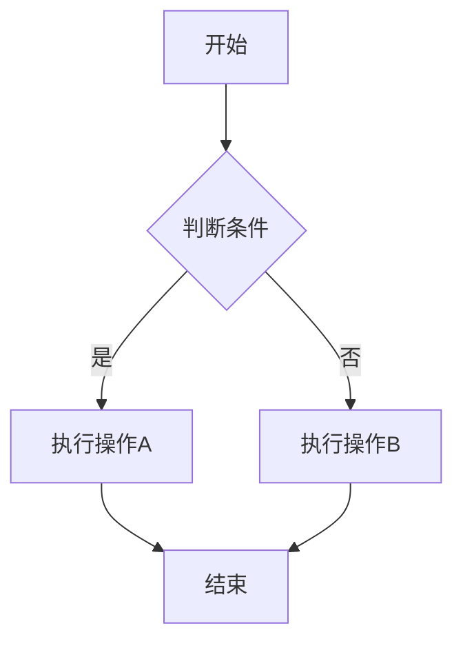
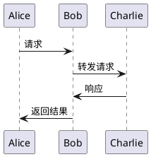
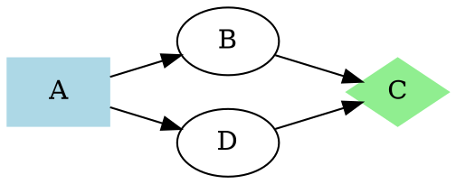

# 统一图表渲染测试

本文档用于测试统一的Kroki图表渲染系统。所有图表类型现在都通过Kroki服务进行渲染，确保一致性和可靠性。

## 1. Mermaid 流程图



## 2. PlantUML 序列图



## 3. Graphviz 图



## 4. BlockDiag 块图

```blockdiag
blockdiag {
    A -> B -> C
    B -> D
    
    A [label = "开始"]
    B [label = "处理"]
    C [label = "结束"]
    D [label = "分支"]
}
```

## 5. SeqDiag 序列图

```seqdiag
seqdiag {
    browser -> webserver [label = "GET /"];
    webserver -> database [label = "SELECT"];
    database -> webserver [label = "Result"];
    webserver -> browser [label = "HTML"];
}
```

## 测试说明

这个测试文档包含了多种图表类型，用于验证：

1. **统一渲染**：所有图表都通过Kroki服务渲染
2. **错误处理**：网络错误或语法错误的处理
3. **缓存机制**：重复渲染时的缓存使用
4. **重试机制**：渲染失败时的自动重试
5. **性能**：异步渲染不阻塞页面加载

## 预期行为

- 所有图表应该异步加载，不阻塞页面渲染
- 加载时显示统一的加载动画
- 渲染成功后显示清晰的SVG图表
- 渲染失败时显示错误信息和重试按钮
- 成功渲染后显示成功通知 