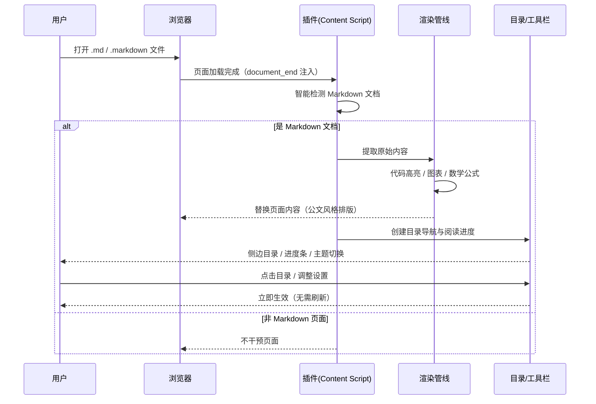
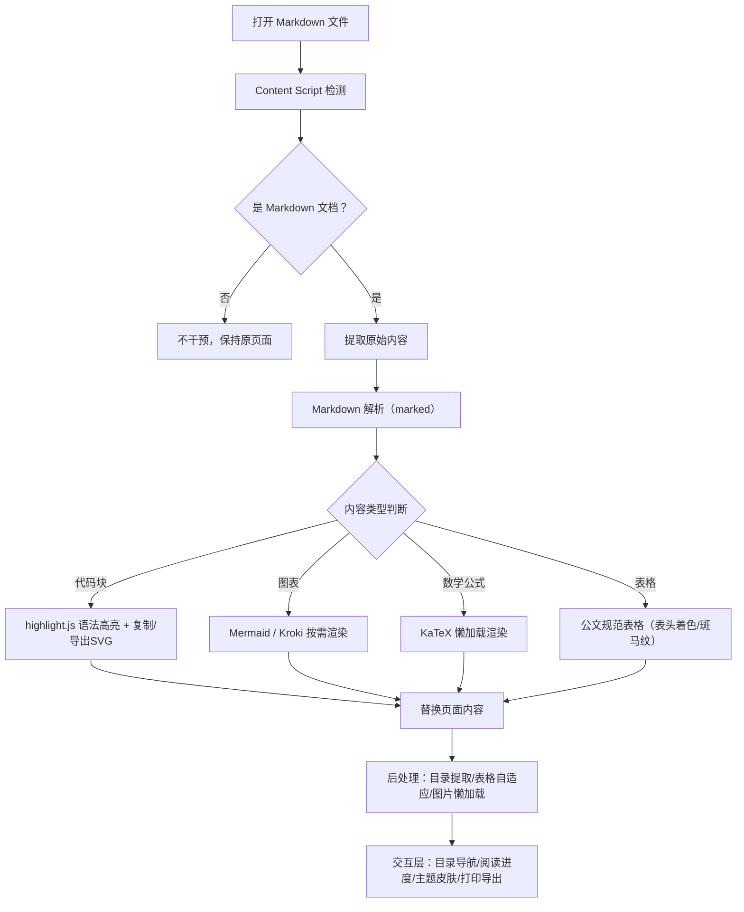

# Markdown Reader Vue

一个基于 Vue.js 3.0 + TypeScript 的现代化浏览器插件，用于在网页中渲染和美化 Markdown 文档。

## ✨ 特性

### 🎨 现代化设计
- **苹果设计美学**：采用苹果最新的 Liquid Glass 材质系统
- **微软交互理念**：融合 Fluent Design 的交互智慧
- **响应式设计**：完美适配桌面、平板和移动设备
- **深色模式**：自动适应系统主题偏好

### 🚀 强大功能
- **Markdown 渲染**：支持 GitHub Flavored Markdown (GFM)
- **代码高亮**：基于 highlight.js 的语法高亮
- **数学公式**：支持 KaTeX 数学公式渲染
- **图表支持**：集成 Mermaid、PlantUML、Kroki 等图表库
- **目录生成**：自动生成文档目录导航
- **图片优化**：懒加载、点击放大、优化显示

### 🛠️ 技术特色
- **Vue 3 Composition API**：现代化的组件开发方式
- **TypeScript**：完整的类型安全保障
- **Pinia 状态管理**：轻量级、类型安全的状态管理
- **Vite 构建**：快速的开发和构建体验
- **Manifest V3**：支持最新的浏览器插件标准

## 📊 渲染效果预览

> 以下时序图与流程图由本插件内置的 Mermaid 引擎直接渲染，
> 打开本 README 即可看到实际效果（图表可双击放大、查看源码、导出 SVG）。

### 插件工作流程（时序图）



### Markdown 渲染管线（流程图）



## 📦 安装


### 开发环境要求
- Node.js >= 16.0.0
- npm >= 8.0.0

### 安装依赖
```bash
npm install
```

### 开发模式
```bash
npm run dev
```

### 构建生产版本
```bash
npm run build
```

### 类型检查
```bash
npm run type-check
```

### 代码格式化
```bash
npm run format
```

### 代码检查
```bash
npm run lint
```

## 🏗️ 项目结构

```
Readmdvue/
├── public/                 # 静态资源
│   └── icons/             # 插件图标
├── src/                   # 源代码
│   ├── api/              # API 请求模块
│   ├── background/       # 后台脚本
│   ├── content/          # 内容脚本
│   ├── popup/            # 弹窗界面
│   ├── stores/           # Pinia 状态管理
│   ├── styles/           # 全局样式
│   ├── types/            # TypeScript 类型定义
│   ├── utils/            # 工具函数
│   ├── App.vue           # 主应用组件
│   └── main.ts           # 应用入口
├── manifest.json         # 插件清单文件
├── popup.html           # 弹窗 HTML
├── package.json         # 项目配置
├── tsconfig.json        # TypeScript 配置
├── vite.config.ts       # Vite 配置
└── README.md           # 项目说明
```

## 🎯 核心模块

### Content Script (`src/content/main.ts`)
负责检测和渲染网页中的 Markdown 内容：
- 自动检测 `.md` 文件
- 提取和解析 Markdown 内容
- 应用样式和主题
- 处理用户交互

### Background Script (`src/background/main.ts`)
处理插件的后台逻辑：
- 消息传递和通信
- 状态管理和同步
- 标签页事件监听
- 配置存储和迁移

### Popup Interface (`src/popup/App.vue`)
提供用户界面和控制面板：
- 插件状态显示
- 功能开关控制
- 主题和样式设置
- 操作按钮和日志

### State Management (`src/stores/plugin.ts`)
基于 Pinia 的状态管理：
- 插件配置管理
- 实时状态同步
- 错误处理和日志
- 性能监控

## 🎨 设计系统

### 色彩系统
- **主色调**：深空灰 (#1D1D1F)、银色 (#F5F5F7)、纯白 (#FFFFFF)
- **强调色**：蓝色 (#007AFF)、紫色 (#AF52DE)、粉色 (#FF2D92) 等 8 种官方色彩
- **Liquid Glass**：半透明材质，动态适应环境

### 字体系统
- **中文**：PingFang SC / Microsoft YaHei UI
- **英文**：SF Pro Display / SF Pro Text / Segoe UI Variable
- **代码**：SF Mono / Cascadia Code / Roboto Mono

### 间距和布局
- **间距系统**：4px 基础单位，8 个层级
- **圆角系统**：4px - 12px 渐进式圆角
- **阴影系统**：3 个层级的细腻阴影

## 🔧 配置选项

### Markdown 渲染
- **代码高亮**：支持 180+ 编程语言
- **数学公式**：KaTeX 渲染引擎
- **图表支持**：Mermaid、PlantUML、Kroki
- **表格增强**：排序、筛选、响应式

### 外观设置
- **主题模式**：自动、浅色、深色
- **字体大小**：12px - 20px 可调
- **行高设置**：1.2 - 2.0 倍行高
- **内容宽度**：自适应或固定宽度

### 功能开关
- **自动渲染**：检测到 Markdown 文件时自动渲染
- **目录显示**：显示/隐藏文档目录
- **图片懒加载**：优化大图片加载性能
- **代码复制**：一键复制代码块

## 🚀 使用指南

### 安装插件
1. 下载或构建插件文件
2. 打开浏览器扩展管理页面
3. 启用「开发者模式」
4. 点击「加载已解压的扩展程序」
5. 选择插件目录

### 使用功能
1. **自动渲染**：访问 `.md` 文件时自动美化显示
2. **手动控制**：点击插件图标打开控制面板
3. **个性化设置**：调整主题、字体、功能开关
4. **导出功能**：将渲染结果导出为 HTML

### 快捷键
- `Ctrl/Cmd + R`：刷新当前页面
- `Escape`：关闭错误提示
- `F12`：打开开发者工具（调试用）

## 🔍 故障排除

### 常见问题

**Q: 插件无法加载？**
A: 检查浏览器版本是否支持 Manifest V3，确保已启用开发者模式。

**Q: Markdown 文件无法渲染？**
A: 确认文件扩展名为 `.md`，检查文件内容是否为有效的 Markdown 格式。

**Q: 数学公式显示异常？**
A: 确保网络连接正常，KaTeX 库需要在线加载字体资源。

**Q: 图表无法显示？**
A: 检查图表语法是否正确，确认对应的图表库已启用。

### 调试模式
开发环境下，插件会输出详细的调试信息到浏览器控制台：
```javascript
// 查看插件状态
console.log(window.__MARKDOWN_READER_DEBUG__)

// 查看渲染性能
console.log(window.__MARKDOWN_READER_PERFORMANCE__)
```

## 🤝 贡献指南

### 开发流程
1. Fork 项目仓库
2. 创建功能分支：`git checkout -b feature/amazing-feature`
3. 提交更改：`git commit -m 'Add amazing feature'`
4. 推送分支：`git push origin feature/amazing-feature`
5. 创建 Pull Request

### 代码规范
- 使用 TypeScript 编写所有代码
- 遵循 ESLint 和 Prettier 配置
- 编写单元测试覆盖核心功能
- 添加适当的注释和文档

### 提交规范
```
feat: 新功能
fix: 修复问题
docs: 文档更新
style: 代码格式调整
refactor: 代码重构
test: 测试相关
chore: 构建或工具相关
```

## 📄 许可证

MIT License - 详见 [LICENSE](LICENSE) 文件

## 🙏 致谢

感谢以下开源项目的支持：
- [Vue.js](https://vuejs.org/) - 渐进式 JavaScript 框架
- [TypeScript](https://www.typescriptlang.org/) - JavaScript 的超集
- [Vite](https://vitejs.dev/) - 下一代前端构建工具
- [Pinia](https://pinia.vuejs.org/) - Vue 状态管理库
- [Marked](https://marked.js.org/) - Markdown 解析器
- [Highlight.js](https://highlightjs.org/) - 语法高亮库
- [KaTeX](https://katex.org/) - 数学公式渲染
- [Mermaid](https://mermaid-js.github.io/) - 图表和流程图

---

**Markdown Reader Vue** - 让 Markdown 阅读更美好 ✨
