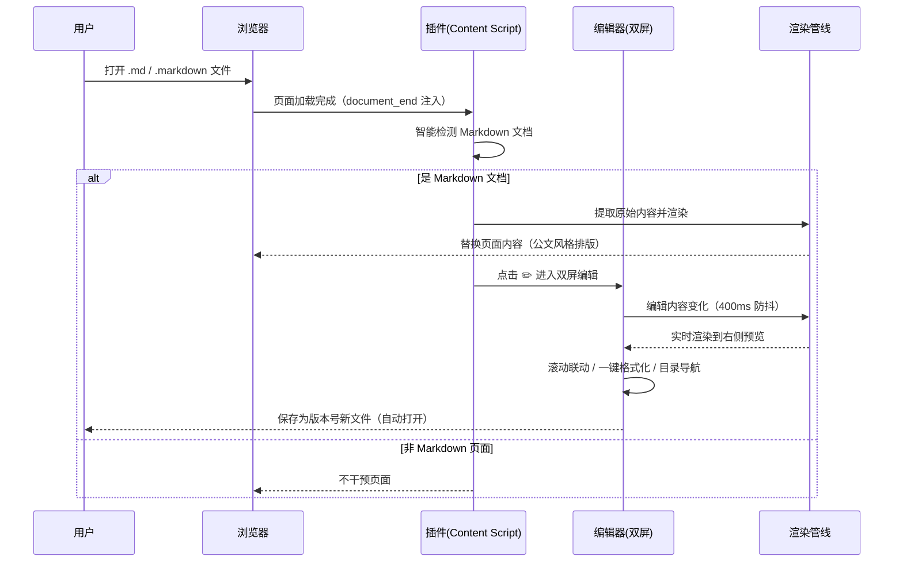
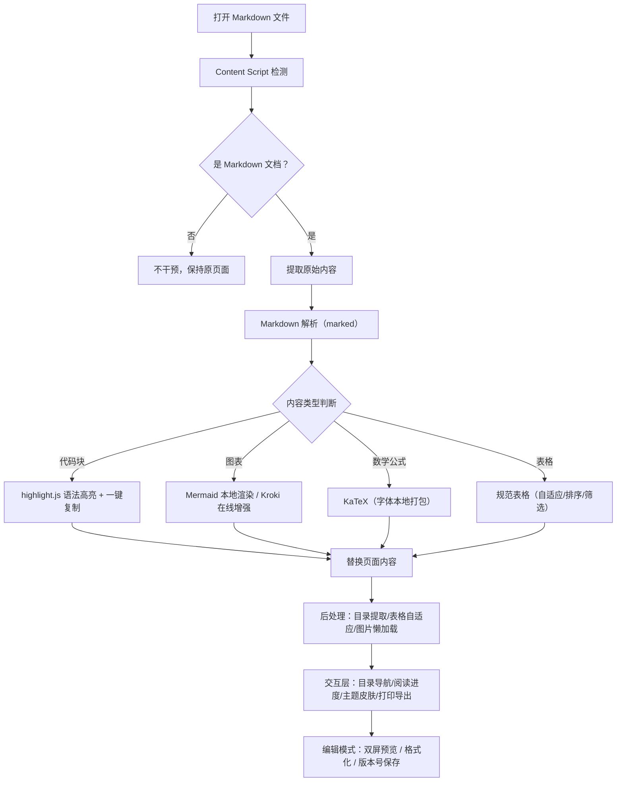

# Markdown Reader Vue（Readmdvue）

**版本：v2.1.2（正式发布）** ｜ 一个基于 Vue 3 + TypeScript 的现代化浏览器插件：**阅读、编辑、离线**三合一的 Markdown 文档工作台。

在浏览器中打开 `.md` / `.markdown` 文件，插件自动接管页面——不仅把文档渲染成精美的阅读排版，还能**直接编辑**：双屏实时预览、一键格式化、版本号另存、保存后自动打开。核心渲染链路**完全离线可用**，无网络环境也能安心工作。

---

## ✨ 核心特性

| 能力 | 说明 |
|---|---|
| 📖 专业阅读 | GFM 语法、180+ 语言代码高亮、KaTeX 公式、Mermaid 图表、自动目录、图片懒加载/放大 |
| ✏️ 双屏编辑 | 左源码右预览并排显示，内容变化实时渲染，所见即所得 |
| 🔗 双向滚动联动 | 滚动编辑区，预览同步跟随；滚动预览区，编辑同步跟随（业界百分比同步方案） |
| 🧹 一键格式化 | 自动规范糟糕的 Markdown 书写（标题/列表/引用符号间隔、表格对齐、多余空行） |
| 💾 版本号另存 | 保存为新版本文件（`README.md → README-v0.01.md`），绝不覆盖原文件 |
| 📂 保存后自动打开 | 保存完成自动用新页签打开新文档（或系统默认程序），闭环无缝 |
| 📴 完全离线 | 解析/高亮/图表/公式全链路本地渲染，零网络请求 |
| 🗂️ 目录导航 | 点击左侧目录任意标题，编辑区与预览区同时定位到对应位置 |

---

## 🚀 快速上手

### 安装

1. 构建插件：`npm install && npm run build`
2. 打开浏览器扩展管理页面（`chrome://extensions`）
3. 开启「开发者模式」
4. 点击「加载已解压的扩展程序」，选择 `dist/` 目录

> 推荐在扩展详情页开启 **「允许访问文件网址」**：本地 `.md` 文件也能渲染，且保存后自动打开新页签需要此权限（见下文「离线使用」）。

### 基本使用

| 场景 | 操作 |
|---|---|
| 阅读 | 直接打开 `.md` 文件（网页或本地），自动渲染美化 |
| 编辑 | 点击左侧目录面板第一个 ✏️ 按钮 |
| 格式化 | 编辑器底部「格式化」按钮 |
| 保存 | 编辑器底部「保存为 xxx」按钮（自动生成版本号文件名） |
| 导出 | 目录面板导出按钮：HTML / PDF / Markdown / PNG / JPEG |

---

## ✏️ 编辑功能详解

### 1. 双屏实时预览

点击目录面板的 ✏️ 按钮进入编辑模式。编辑器**双栏布局**：

- **左侧**：Markdown 源码编辑（CodeMirror 6，本地打包，离线可用）
- **右侧**：渲染预览（与正式阅读渲染完全同一套管线：代码高亮、图表、公式、皮肤样式）

编辑内容停顿 400ms 后自动渲染到右侧——**无需任何点击切换，打开即双屏**。弹窗默认占满可用空间（自动避让左侧目录面板，目录展开/折叠/隐藏时弹窗宽度动态跟随）。

### 2. 双向滚动联动

编辑区与预览区的滚动条**按百分比双向同步**（业界 Joplin / Typora 同款方案）：

- 滚动左侧编辑 → 右侧预览跟随到对应位置
- 滚动右侧预览 → 左侧编辑跟随到对应位置
- 两端天然对齐：编辑滚到顶部，预览也在顶部；编辑滚到底部，预览必到底

即使预览内容因图片/图表渲染后变长，也不会出现「编辑到底、预览还在半空」的错位。

### 3. 一键格式化（Markdown 书写规范）

很多文档的 Markdown 书写不规范（符号缺空格、间距混乱）。点击编辑器底部的 **「格式化」** 按钮，自动修复：

| 问题 | 格式化前 | 格式化后 |
|---|---|---|
| 标题缺空格 | `#标题` | `# 标题` |
| 列表缺空格 | `-项目` | `- 项目` |
| 有序列表缺空格 | `1.第一项` | `1. 第一项` |
| 引用缺空格 | `>引用` | `> 引用` |
| 表格未对齐 | `\| a \| b \|` | 自动列对齐 |
| 行尾多余空白 / 连续空行 | — | 自动清理 |

代码块（由三个反引号 ```` 包裹的围栏）内的内容**安全跳过**，不会被误改；`---` 分隔线、`1.2版本` 这类版本号也不会误伤。格式化引擎 = 自研规范化器 + Prettier（业界标准），仅在首次点击时加载（约 90KB），不影响插件启动速度。

### 4. 版本号另存（不覆盖原文件）

保存时**自动生成新版本文件名**，原文件永远不动：

| 原文件名 | 保存为 | 规则 |
|---|---|---|
| `README.md` | `README-v0.01.md` | 无版本号 → 追加 `-v0.01` |
| `README-v2.0.0.md` | `README-v2.0.1.md` | 有版本号 → 最后一段数字 +1 |
| `README-v0.01.md` | `README-v0.02.md` | 再次保存继续 +1（保留位数） |
| `README-v2.md` | `README-v3.md` | 单段版本号同样 +1 |

### 5. 保存后自动打开

保存成功后自动打开新文档，无需手动寻找文件：

1. **优先**：新页签 `file://` 打开（插件自动渲染新文档，可继续阅读/编辑）
2. 降级：系统默认程序打开（如已安装的 Markdown 编辑器）
3. 兜底：文件已安全保存，提示开启权限方式

> ⚠️ 新页签自动打开需要扩展详情页开启 **「允许访问文件网址」**（Chrome 安全机制，一次开启永久生效）。

### 6. 目录导航

编辑弹窗打开时，点击左侧目录面板任意标题——**预览区和编辑区同时定位**到该标题，长文档快速跳转。弹窗关闭时目录点击行为不变（正常滚动页面）。

---


---

## 📊 渲染效果预览

> 以下时序图与流程图由本插件内置的 Mermaid 引擎直接渲染，
> 打开本 README 即可看到实际效果（图表可双击放大、查看源码、导出 SVG）。

### 阅读 + 编辑工作流（时序图）



### Markdown 渲染管线（流程图）



## 📖 阅读功能

- **Markdown 渲染**：GitHub Flavored Markdown（GFM），含任务列表
- **代码高亮**：180+ 编程语言（highlight.js 全量本地打包）
- **数学公式**：KaTeX（JS + CSS + 字体全部打包本地，离线可用）
- **图表**：Mermaid（本地全量渲染）+ Kroki（在线增强：PlantUML / GraphViz 等）
- **目录生成**：自动提取标题，侧边导航 + 阅读进度条
- **图片优化**：懒加载、点击放大、错误占位
- **表格增强**：排序、筛选、响应式、字号自适应
- **皮肤系统**：政府公文（gov）/ 自由现代（free）双排版
- **导出**：HTML / PDF / Markdown / PNG / JPEG

---

## 📴 离线使用

### 离线可用范围（零网络请求）

| 能力 | 说明 |
|---|---|
| Markdown 解析 | marked 本地库 |
| 代码高亮 | highlight.js 本地全量 |
| Mermaid 图表 | 本地 UMD 全量包渲染 |
| KaTeX 公式 | JS + CSS + 字体全部打包本地 |

### 需要联网的场景

| 场景 | 离线表现 |
|---|---|
| Kroki 图表（PlantUML / GraphViz 等） | 离线降级：显示「离线模式」+ 源码块（可复制），不发网络请求 |
| 文档内引用的远程图片 | 显示占位，不阻塞阅读 |
| Markdown 源文件本身 | 网页文件需在线；本地 `file://` 文件离线可用 |

### 本地文件使用前提

插件默认对 `http(s)` 页面注入。要渲染**本地 `.md` 文件**，请先在 `chrome://extensions` → 插件详情页开启 **「允许访问文件网址」**，一次开启永久生效（也是「保存后自动打开」的前提）。

---

## 🎨 外观与配置

### 主题与皮肤
- **主题模式**：深色（默认）/ 浅色 / 跟随系统
- **皮肤**：政府公文（gov）/ 自由现代（free）
- **强调色**：蓝 / 紫 / 粉等 8 种官方色彩 + 自定义色 + 收藏色
- **Liquid Glass**：苹果风格半透明毛玻璃材质，深色/浅色自适应

### 排版设置
- **字号**：12px - 20px 可调（默认 16px）
- **行高**：1.2 - 2.0 倍（默认 1.8）
- **内容宽度**：自适应或固定宽度（默认 1200px）
- **字体**：PingFang / SF Pro / 思源宋体 / 仿宋 等系统字体栈

### 功能开关
- 代码高亮 / 图表（Mermaid、Kroki）/ 数学公式 / 表格增强 / 任务列表
- 图片点击放大 / 代码一键复制 / 行号显示 / 自动换行
- 自动保存（5s 间隔，配置持久化到浏览器存储）

---

## 🏗️ 项目结构

```
Readmdvue/
├── public/                          # 静态资源（图标等）
├── src/
│   ├── background/main.ts           # 后台脚本（保存文件、自动打开、消息路由）
│   ├── content/
│   │   ├── main.ts                  # 内容脚本（渲染管线、事件接线）
│   │   └── vueIntegration.ts        # Vue 组件管理器（编辑器/设置/导出互斥）
│   ├── components/
│   │   ├── MarkdownEditor.vue       # 双屏编辑器（CodeMirror + 预览 + 格式化）
│   │   ├── TableOfContents.vue      # 目录面板（编辑按钮、导航、进度）
│   │   ├── ExportDialog.vue         # 导出对话框
│   │   └── ...                      # 设置面板、图表渲染、打赏等
│   ├── utils/
│   │   ├── markdownRenderer.ts      # 渲染管线（marked + 后处理）
│   │   ├── markdownNormalizer.ts    # Markdown 书写规范化器
│   │   ├── versionedFilename.ts     # 版本号文件名规则
│   │   ├── asyncChartRenderer.ts    # 图表渲染（Mermaid 本地 + Kroki）
│   │   └── ...
│   ├── styles/                      # 全局样式（苹果设计系统等）
│   ├── stores/                      # Pinia 状态
│   └── types/                       # 类型定义
├── manifest.json                    # 插件清单（MV3）
├── vite.config.ts                   # Vite 构建（动态 chunk 重写等）
└── README.md                        # 本文档
```

---

## 🔧 开发

### 环境要求
- Node.js >= 18.0.0，npm >= 8.0.0

### 常用命令

| 命令 | 说明 |
|---|---|
| `npm run dev` | 开发模式（热更新） |
| `npm run build` | 构建生产版本（vue-tsc 类型检查 + vite build） |
| `npm run type-check` | 类型检查 |
| `npm run lint` | 代码检查 |
| `npm run format` | 代码格式化 |

### 单元测试

```bash
# 版本号文件名规则（13 个用例）
node --experimental-strip-types scripts/test-versioned.ts

# Markdown 规范化 + Prettier 组合（16 个用例）
node scripts/test-normalize.mjs
```

---

## 🔍 故障排除

**Q: 插件无法加载？**
A: 确认浏览器支持 Manifest V3，已开启「开发者模式」。

**Q: 本地 .md 文件没有渲染？**
A: 在 `chrome://extensions` → 插件详情页开启 **「允许访问文件网址」**。

**Q: 保存后没有自动打开新页签？**
A: 同样是「允许访问文件网址」未开启——此时会降级为系统默认程序打开；开启后自动用新页签打开。

**Q: 数学公式显示异常？**
A: 字体已打包本地，离线可用；若异常请确认插件已重新加载（升级后需在扩展管理页刷新）。

**Q: 非 Mermaid 图表（PlantUML 等）离线不显示？**
A: 正常——Kroki 图表需联网渲染；离线时显示源码块，联网后自动恢复。

**Q: 格式化报错？**
A: 多为文档存在未闭合代码块等语法问题，修正后重试即可。

---

## 🤝 贡献指南

### 开发流程
1. Fork 项目仓库
2. 创建功能分支：`git checkout -b feature/amazing-feature`
3. 提交更改：`git commit -m 'feat: 新功能'`
4. 推送分支：`git push origin feature/amazing-feature`
5. 创建 Pull Request

### 提交规范
```
feat: 新功能
fix: 修复问题
docs: 文档更新
style: 代码风格调整
refactor: 代码重构
test: 测试相关
chore: 构建或工具相关
```

---

## 📄 许可证

MIT License

## 🙏 致谢

感谢以下开源项目的支持：
- [Vue.js](https://vuejs.org/) - 渐进式 JavaScript 框架
- [TypeScript](https://www.typescriptlang.org/) - JavaScript 的超集
- [Vite](https://vitejs.dev/) - 下一代前端构建工具
- [Pinia](https://pinia.vuejs.org/) - Vue 状态管理库
- [Marked](https://marked.js.org/) - Markdown 解析器
- [Highlight.js](https://highlightjs.org/) - 语法高亮库
- [KaTeX](https://katex.org/) - 数学公式渲染
- [Mermaid](https://mermaid-js.github.io/) - 图表和流程图
- [Prettier](https://prettier.io/) - 代码/文档格式化
- [CodeMirror](https://codemirror.net/) - 代码编辑器

---

**Markdown Reader Vue** - 阅读、编辑、离线，让 Markdown 更好用 ✨
