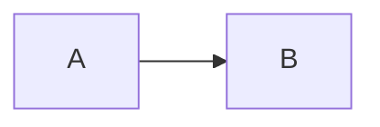
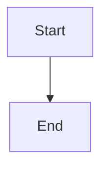
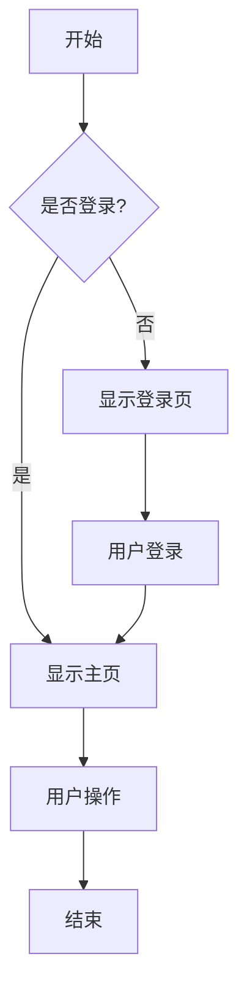
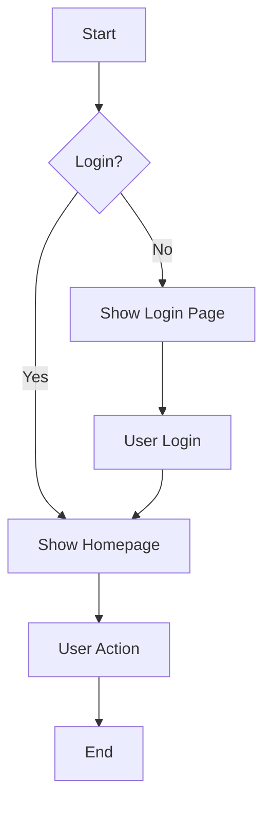

# Mermaid 图表渲染问题诊断

## 问题分析

根据您的反馈，Mermaid 图表渲染失败而其他图表（PlantUML、Graphviz）成功。让我们逐步分析可能的原因：

### 1. Mermaid 语法验证

让我们测试一个最简单的 Mermaid 图表：

### 2. 稍微复杂的 Mermaid 图表

### 3. 原始测试图表（可能有问题）

## 可能的问题原因

### 1. **中文字符问题**
- Kroki 服务可能对中文字符支持有限
- 建议使用英文标签测试

### 2. **Mermaid 语法版本兼容性**
- 不同版本的 Mermaid 语法可能有差异
- Kroki 使用的 Mermaid 版本可能不支持某些语法

### 3. **网络超时或服务问题**
- Kroki.io 的 Mermaid 服务可能暂时不可用
- 网络连接问题

### 4. **编码问题**
- POST 请求的内容编码可能有问题
- Content-Type 设置可能不正确

## 测试用英文版本

## 调试建议

1. **检查控制台错误信息**
   - 打开浏览器开发者工具
   - 查看 Network 标签页的请求详情
   - 查看 Console 标签页的错误信息

2. **测试 Kroki API**
   - 直接访问 `https://kroki.io/mermaid/svg` 
   - 使用 POST 请求发送简单的 Mermaid 代码

3. **检查请求格式**
   - 确认 Content-Type 为 `text/plain`
   - 确认请求体是纯文本格式

4. **尝试其他 Mermaid 图表类型**
   - 序列图 (sequenceDiagram)
   - 流程图 (flowchart)
   - 类图 (classDiagram)

---

**诊断时间：** 2024-12-19  
**问题：** Mermaid 图表渲染失败  
**状态：** 待验证