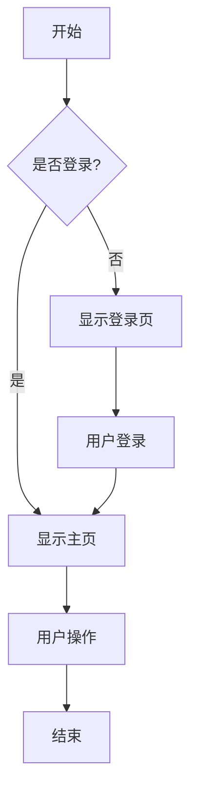
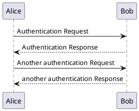
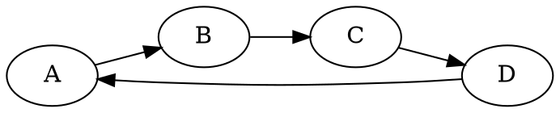

# 图表渲染修复验证测试

这个文档用于验证 `retryChart` 函数修复和超时时间改进的效果。

## 修复内容

### 1. retryChart 函数修复
- ✅ 确保全局函数在页面加载时立即可用
- ✅ 添加详细的调试日志
- ✅ 修复函数暴露问题

### 2. 超时时间改进
- ✅ 默认超时时间从 15 秒增加到 30 秒
- ✅ 重试时超时时间也增加到 30 秒
- ✅ 改进错误处理和用户反馈

## 测试图表

### Mermaid 流程图

### PlantUML 序列图

### Graphviz 图

## 验证要点

### 1. retryChart 函数可用性
- 如果图表渲染失败，应该显示重试按钮
- 点击重试按钮不应该出现 "retryChart is not defined" 错误
- 重试过程应该有详细的控制台日志输出

### 2. 超时处理改进
- 图表渲染超时时间现在是 30 秒（之前是 15 秒）
- 如果网络较慢，应该有更多时间完成渲染
- 超时错误信息应该更友好

### 3. 错误处理
- 网络错误应该显示明确的错误信息
- 语法错误应该提供有用的提示
- 重试功能应该正常工作

## 测试步骤

1. **加载测试** - 打开这个文档，观察图表是否正常加载
2. **超时测试** - 如果网络较慢，观察是否有足够时间完成渲染
3. **重试测试** - 如果图表渲染失败，点击重试按钮验证功能
4. **控制台检查** - 打开开发者工具，检查是否有 retryChart 相关错误

## 预期结果

- ✅ 所有图表应该在 30 秒内成功渲染
- ✅ 如果渲染失败，重试按钮应该正常工作
- ✅ 不应该出现 "retryChart is not defined" 错误
- ✅ 控制台应该有详细的调试信息

---

**测试时间：** 2024-12-19  
**修复版本：** v2.1.0  
**主要改进：** retryChart 函数修复 + 超时时间优化