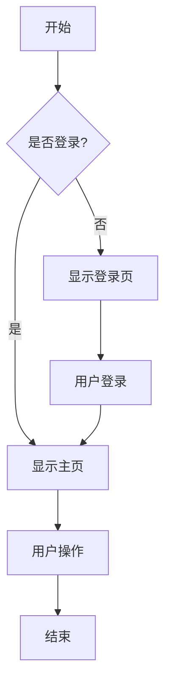
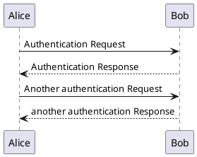
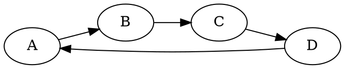

# 图表渲染测试文档

这个文档用于测试修复后的图表动态渲染功能。

## Mermaid 流程图

## PlantUML 序列图

## Graphviz 图

## 测试说明

如果修复成功，上述图表应该：

1. **不会显示为纯文本** - 图表代码不应该作为字符串直接显示在页面上
2. **显示加载状态** - 初始时应该显示"正在渲染 XXX 图表 (Kroki)..."的加载提示
3. **动态渲染** - 通过JavaScript异步调用Kroki服务生成图表图片
4. **错误处理** - 如果渲染失败，应该显示错误信息和重试按钮
5. **重试功能** - 点击重试按钮应该能够重新尝试渲染图表

这个修复解决了图表显示的核心问题：从静态字符串展示转变为动态JavaScript渲染。