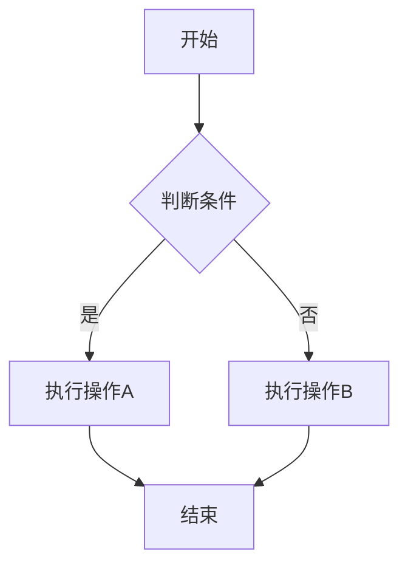
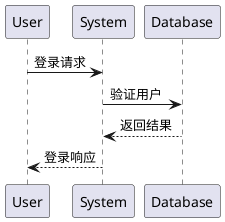
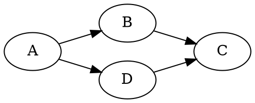
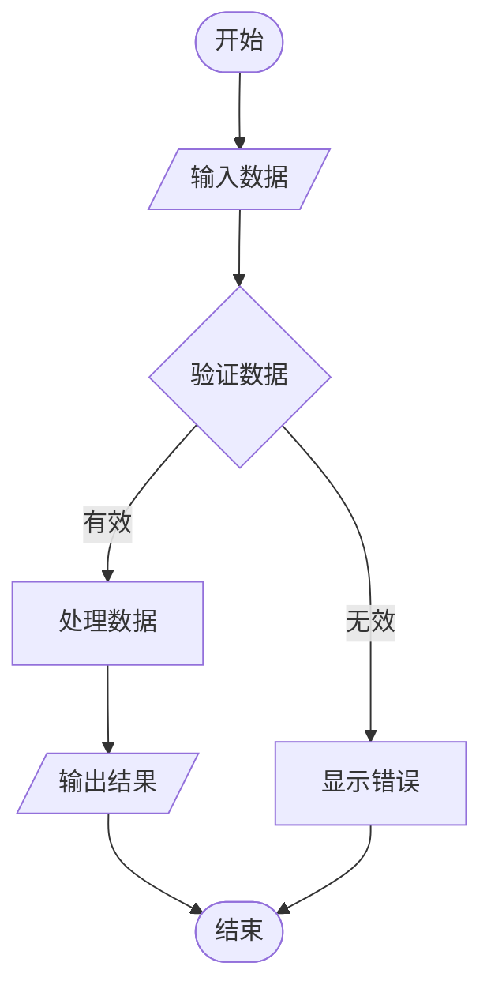

# 智能代码块类型识别测试

本文档用于测试智能代码块分析器的功能，展示如何准确区分代码和图表。

## 1. 明确标记的图表类型

### Mermaid 流程图


### PlantUML 序列图


### Graphviz 图


## 2. 明确标记的编程语言

### JavaScript 代码
```javascript
function calculateSum(a, b) {
    return a + b;
}

const result = calculateSum(5, 3);
console.log(result); // 输出: 8
```

### Python 代码
```python
def fibonacci(n):
    if n <= 1:
        return n
    return fibonacci(n-1) + fibonacci(n-2)

# 计算前10个斐波那契数
for i in range(10):
    print(f"F({i}) = {fibonacci(i)}")
```

### JSON 数据
```json
{
  "name": "智能分析器",
  "version": "1.0.0",
  "features": [
    "代码块类型识别",
    "图表自动渲染",
    "智能回退机制"
  ],
  "confidence": 0.95
}
```

## 3. 错误标记的情况

### 标记为JavaScript但实际是Mermaid
```javascript
graph LR
    A[用户输入] --> B[数据验证]
    B --> C[处理逻辑]
    C --> D[返回结果]
```
*应该被智能识别为图表并提示标记错误*

### 标记为PlantUML但实际是代码
```plantuml
function processData(input) {
    const validated = validateInput(input);
    const processed = transformData(validated);
    return processed;
}
```
*应该被识别为代码并提示标记错误*

## 4. 未知类型的智能推断

### 无标记的Mermaid图表
```
sequenceDiagram
    participant A as 客户端
    participant B as 服务器
    participant C as 数据库
    
    A->>B: 发送请求
    B->>C: 查询数据
    C-->>B: 返回数据
    B-->>A: 响应结果
```
*应该被智能识别为Mermaid图表*

### 无标记的PlantUML图表
```
@startuml
class User {
    +String name
    +String email
    +login()
    +logout()
}

class Admin {
    +manageUsers()
    +viewLogs()
}

User <|-- Admin
@enduml
```
*应该被智能识别为PlantUML图表*

### 无标记的普通文本
```
这是一段普通的文本内容
没有任何图表特征
应该显示为纯文本代码块
```
*应该被识别为普通文本*

## 5. 边界情况测试

### 包含箭头但不是图表的代码
```cpp
#include <iostream>
using namespace std;

int main() {
    int a = 5;
    int* ptr = &a;  // 指针操作符 ->
    cout << "Value: " << *ptr << endl;
    return 0;
}
```
*应该被识别为C++代码，不是图表*

### 混合内容
```yaml
# 配置文件
database:
  host: localhost
  port: 5432
  
# 但包含一些图表特征
workflow:
  start -> validate -> process -> end
```
*应该根据主要特征判断为YAML配置*

## 6. 置信度测试

### 高置信度图表


### 低置信度情况
```unknown
some -> data
but -> not -> clear
what -> type
```
*置信度应该较低，可能显示为代码*

## 测试说明

1. **智能识别**: 系统应该能够准确识别每个代码块的类型
2. **置信度显示**: 每个识别结果都应该显示置信度百分比
3. **错误处理**: 图表渲染失败时应该自动回退到代码显示
4. **用户提示**: 对于错误标记的情况，应该给出友好的提示信息
5. **性能**: 分析过程应该快速，不影响页面渲染性能

## 预期结果

- ✅ 明确标记的图表类型应该正确渲染
- ✅ 明确标记的编程语言应该正确高亮
- ✅ 错误标记应该被检测并给出提示
- ✅ 未知类型应该能够智能推断
- ✅ 边界情况应该有合理的处理
- ✅ 所有操作都应该有适当的置信度评分