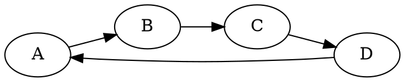
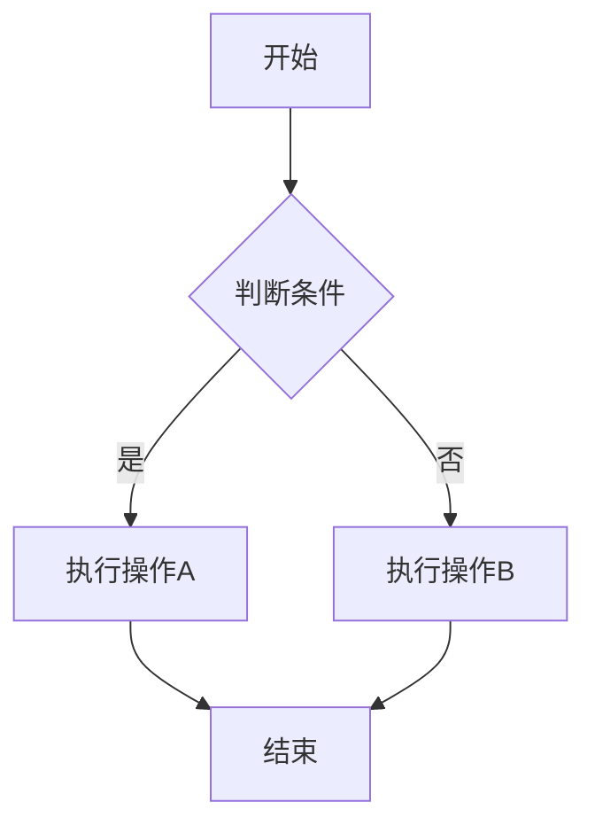
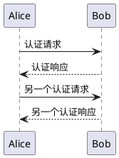
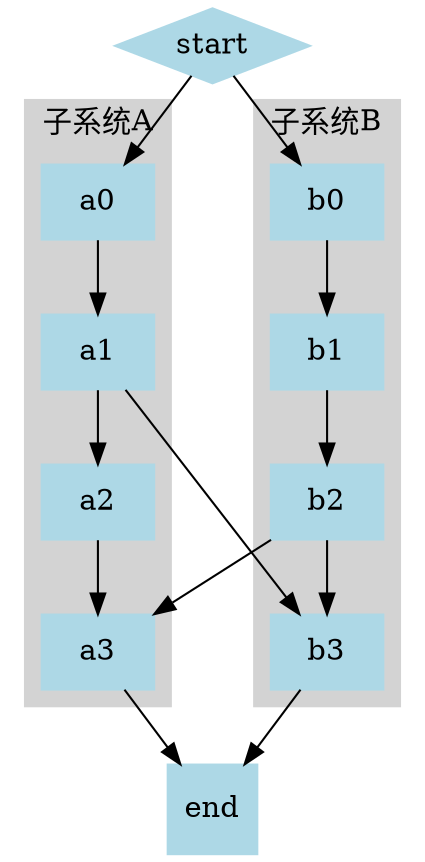

# Kroki Base64 编码修复测试

## 测试说明
这个文档用于测试修复后的 Kroki Base64 编码问题。

## 1. 简单的 Graphviz 图表

## 2. 包含特殊字符的 Graphviz 图表

## 3. Mermaid 流程图

## 4. PlantUML 序列图

## 5. 复杂的 Graphviz 图表

## 测试要点

1. **Base64 编码**: 确保所有图表内容都能正确编码
2. **特殊字符处理**: 中文字符和特殊符号的正确处理
3. **语法验证**: 基本的图表语法检查
4. **错误处理**: 无效内容的错误提示
5. **网络请求**: Kroki API 的正确调用

## 预期结果

- 所有图表都应该能够正常渲染
- 不应该出现 400 Bad Request 错误
- 控制台应该显示正确的 URL 生成日志
- 错误的图表语法应该有适当的警告或错误提示