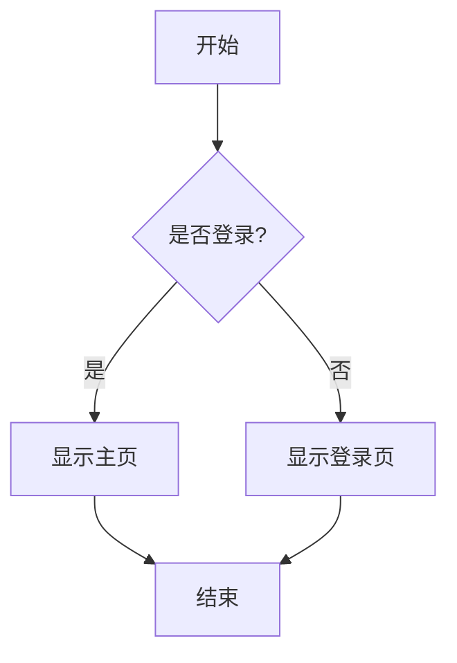
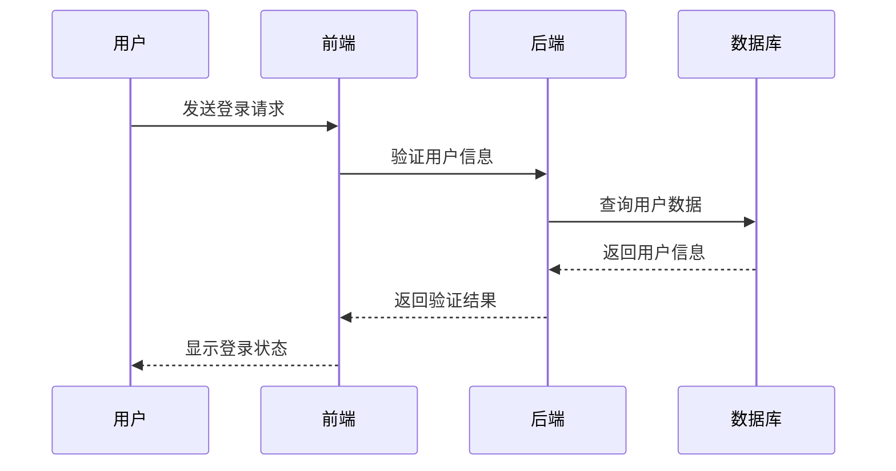
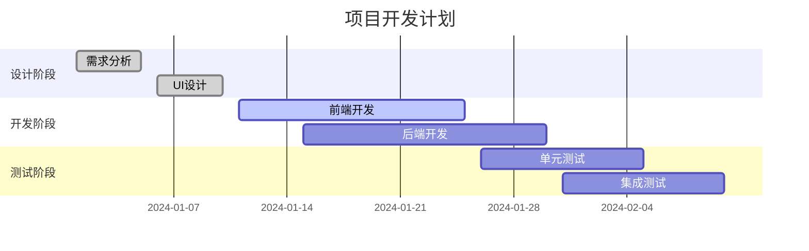
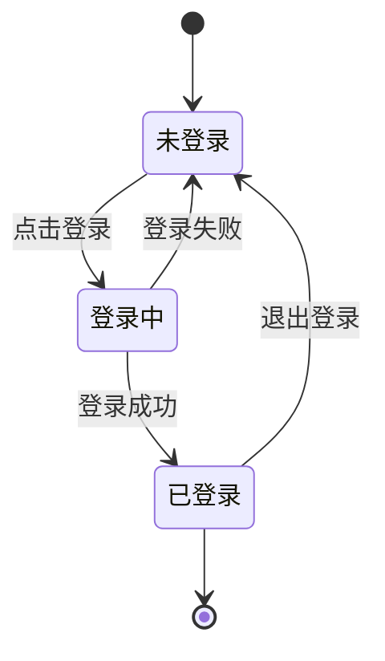
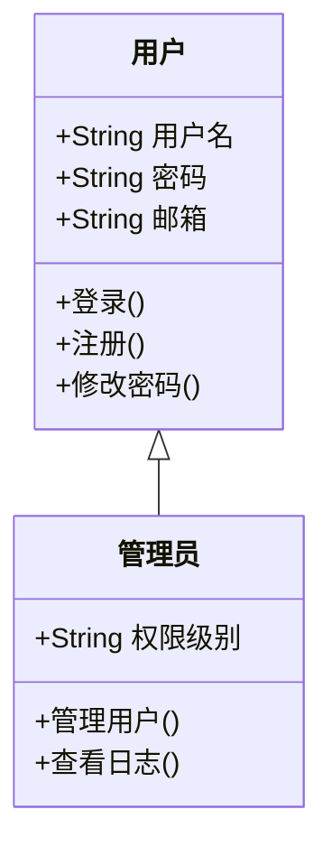
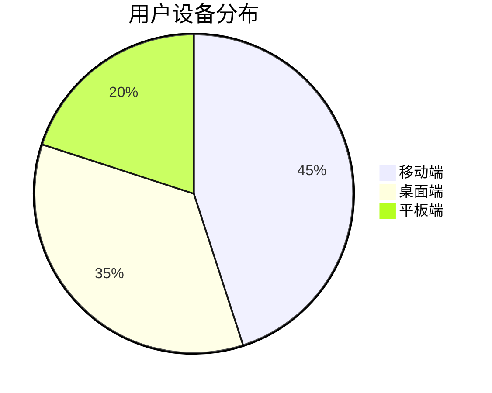

# 本地 Mermaid 渲染器测试

## 修复内容

### 1. 本地 Mermaid 渲染器实现
- ✅ 创建了 `LocalMermaidRenderer` 类
- ✅ 支持本地 Mermaid 库渲染
- ✅ 优化中文字符支持
- ✅ 添加语法验证和错误处理
- ✅ 实现本地渲染失败时回退到 Kroki 服务

### 2. 集成到异步渲染器
- ✅ 在 `asyncChartRenderer.ts` 中集成本地渲染器
- ✅ Mermaid 图表优先使用本地渲染
- ✅ 本地渲染失败时自动回退到 Kroki
- ✅ 保持与其他图表类型的兼容性

## 测试图表

### 简单流程图

### 序列图（中文支持测试）

### 甘特图

### 状态图

### 类图

### 饼图

## 验证要点

### 1. 本地渲染优先级
- [ ] Mermaid 图表应优先使用本地渲染器
- [ ] 渲染速度应比 Kroki 服务更快
- [ ] 中文字符应正确显示

### 2. 回退机制
- [ ] 本地渲染失败时应自动回退到 Kroki
- [ ] 回退过程应对用户透明
- [ ] 错误信息应清晰明确

### 3. 兼容性测试
- [ ] 所有 Mermaid 图表类型都应正常渲染
- [ ] 复杂语法应得到支持
- [ ] 样式应与设计系统保持一致

### 4. 性能测试
- [ ] 本地渲染应比网络请求更快
- [ ] 内存使用应在合理范围内
- [ ] 不应影响其他图表类型的渲染

## 测试步骤

1. **加载测试页面**
   - 打开包含 Mermaid 图表的 Markdown 文件
   - 观察图表加载过程和最终效果

2. **检查渲染方式**
   - 打开浏览器开发者工具
   - 查看控制台日志确认使用本地渲染
   - 验证是否有 Kroki 网络请求

3. **测试中文支持**
   - 重点检查包含中文的序列图和甘特图
   - 确认中文字符正确显示且无乱码

4. **测试错误处理**
   - 故意输入错误的 Mermaid 语法
   - 验证错误提示和回退机制

5. **性能对比**
   - 对比本地渲染和 Kroki 渲染的速度
   - 测试大量图表的渲染性能

## 预期结果

- ✅ 所有 Mermaid 图表应正常显示
- ✅ 中文字符应完美支持
- ✅ 渲染速度应显著提升
- ✅ 错误处理应更加友好
- ✅ 与其他图表类型保持兼容