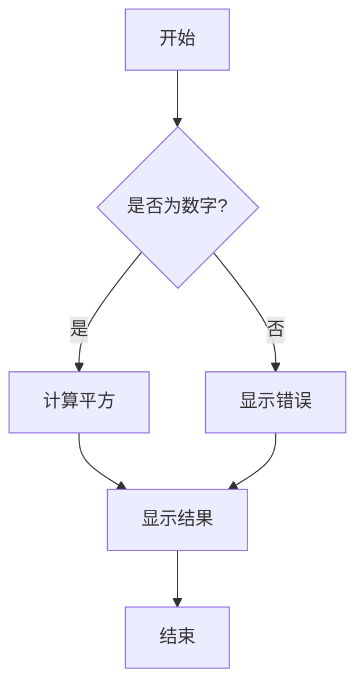

# Markdown Reader Vue 插件测试文档

## 数学公式测试

### 行内数学公式
这是一个简单的行内公式：$E = mc^2$

这是一个更复杂的行内公式：$\sum_{i=1}^{n} x_i = x_1 + x_2 + \cdots + x_n$

分数公式：$\frac{a}{b} = \frac{c}{d}$

根号公式：$\sqrt{x^2 + y^2}$

### 块级数学公式

经典的高斯积分：
$$\int_{-\infty}^{\infty} e^{-x^2} dx = \sqrt{\pi}$$

矩阵表示：
$$\begin{pmatrix}
a & b \\
c & d
\end{pmatrix}
\begin{pmatrix}
x \\
y
\end{pmatrix}
=
\begin{pmatrix}
ax + by \\
cx + dy
\end{pmatrix}$$

求和公式：
$$\sum_{k=1}^{n} k^2 = \frac{n(n+1)(2n+1)}{6}$$

极限公式：
$$\lim_{x \to 0} \frac{\sin x}{x} = 1$$

微分方程：
$$\frac{d^2y}{dx^2} + \omega^2 y = 0$$

### 复杂数学公式

傅里叶变换：
$$\mathcal{F}[f(t)] = \int_{-\infty}^{\infty} f(t) e^{-2\pi i \xi t} dt$$

薛定谔方程：
$$i\hbar\frac{\partial}{\partial t}\Psi(\mathbf{r},t) = \hat{H}\Psi(\mathbf{r},t)$$

麦克斯韦方程组：
$$\begin{align}
\nabla \cdot \mathbf{E} &= \frac{\rho}{\epsilon_0} \\
\nabla \cdot \mathbf{B} &= 0 \\
\nabla \times \mathbf{E} &= -\frac{\partial \mathbf{B}}{\partial t} \\
\nabla \times \mathbf{B} &= \mu_0\mathbf{J} + \mu_0\epsilon_0\frac{\partial \mathbf{E}}{\partial t}
\end{align}$$

## 基础Markdown测试

### 标题测试
# 一级标题
## 二级标题
### 三级标题
#### 四级标题
##### 五级标题
###### 六级标题

### 文本样式
**粗体文本**
*斜体文本*
~~删除线文本~~
`行内代码`

### 列表测试
#### 无序列表
- 项目1
- 项目2
  - 子项目2.1
  - 子项目2.2
- 项目3

#### 有序列表
1. 第一项
2. 第二项
   1. 子项目2.1
   2. 子项目2.2
3. 第三项

### 链接和图片
[GitHub](https://github.com)

<!-- 图片示例：如果有真实图片地址，可以在这里添加 -->
<!--  -->

### 代码块测试

#### JavaScript代码
```javascript
function fibonacci(n) {
  if (n <= 1) return n;
  return fibonacci(n - 1) + fibonacci(n - 2);
}

console.log(fibonacci(10)); // 55
```

#### Python代码
```python
def quicksort(arr):
    if len(arr) <= 1:
        return arr
    pivot = arr[len(arr) // 2]
    left = [x for x in arr if x < pivot]
    middle = [x for x in arr if x == pivot]
    right = [x for x in arr if x > pivot]
    return quicksort(left) + middle + quicksort(right)

print(quicksort([3,6,8,10,1,2,1]))
```

### 表格测试
| 姓名 | 年龄 | 城市 |
|------|------|------|
| 张三 | 25   | 北京 |
| 李四 | 30   | 上海 |
| 王五 | 28   | 广州 |

### 引用测试
> 这是一个引用块。
> 
> 可以包含多行内容。
> 
> > 这是嵌套引用。

### Mermaid图表测试


### 分割线
---

### 任务列表
- [x] 完成数学公式渲染
- [x] 添加代码高亮
- [ ] 优化移动端显示
- [ ] 添加主题切换功能